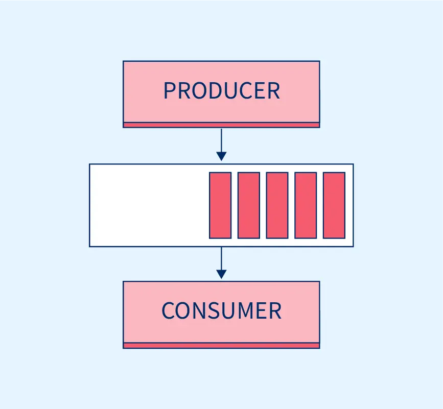
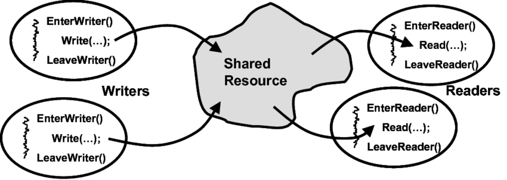

# Concurrencia con *Swift*
## Casos de uso
- **Conexiones**: descargas, subidas, peticiones web...
- **Procesamientos costosos**: imagen, vídeo, 3D, cálculos...
- **Eventos programados**: alarmas, copias de seguridad...
- **Recursos compartidos**: sistema operativo, servidor, computación distribuida...

## Conceptos importantes:
- Concurrencia (*paralelo* VS *serie*, *condiciones de carrera* VS *atomicidad*)
- Distribuido (*centralizado* VS *descentralizado* VS *distribuido*)
- Proceso (*OS process*)
- Hilo (*Thread*)
- Sincronización (*sync* / *async*)
- Prioridad (*Quality of Service*)
## Problemas
### Productores y Consumidores

### Lectores y Escritores

### Filósofos comilones

## Cola
Función que espera unos segundos avisa al terminar:
```swift
func esperar(segundos: Double, fin: @escaping () -> ()) {
	DispatchQueue.global().async {
		Thread.sleep(forTimeInterval: segundos)
		fin()
	}
}
```
Se puede especificar la prioridad con este orden:
- `userInteractive`: Ejecución en el hilo principal, para tareas tienen una respuesta inmediata.
- `userInitiatited`: Tareas de unos segundos.
- `utility`: Tareas hasta pocos segundos o minutos (con barra de carga).
- `background`: Ejecución en segundo plano, el usuario no tiene porqué saber que se está ejecutando.
## Tarea
Usando las palabras clave `async` y `await` con la clase `Task` se consigue un comportamiento equivalente a usar *closure* y `DispatchQueue` con un código más limpio y sin anidar tareas encadenadas.
```swift
func wait(seconds: Double) async {
  Thread.sleep(forTimeInterval: seconds)
}
```
Se informa al usuario de que se va a hacer una tarea, se llama a la función y al usar `await` la ejecución espera antes de ejecutar la siguiente sentencia.
```swift
Button(info) {
	info = "Cargando..."
	Task {
		await wait(seconds: 3)
		info = "Vamos!"
	}
}
```
## Semáforo
Semáforo de 3 bolas con 10 tareas:
```swift
let concurrentes = 3
let semaphore = DispatchSemaphore(value: concurrentes)
for i in 0..<10 {
  DispatchQueue.global().async {
    let number = i + 1
    semaphore.wait()
    print("Trabajando en", number)
    sleep(2)
    print(number, "finalizado.")
    semaphore.signal()
  }
}
```
